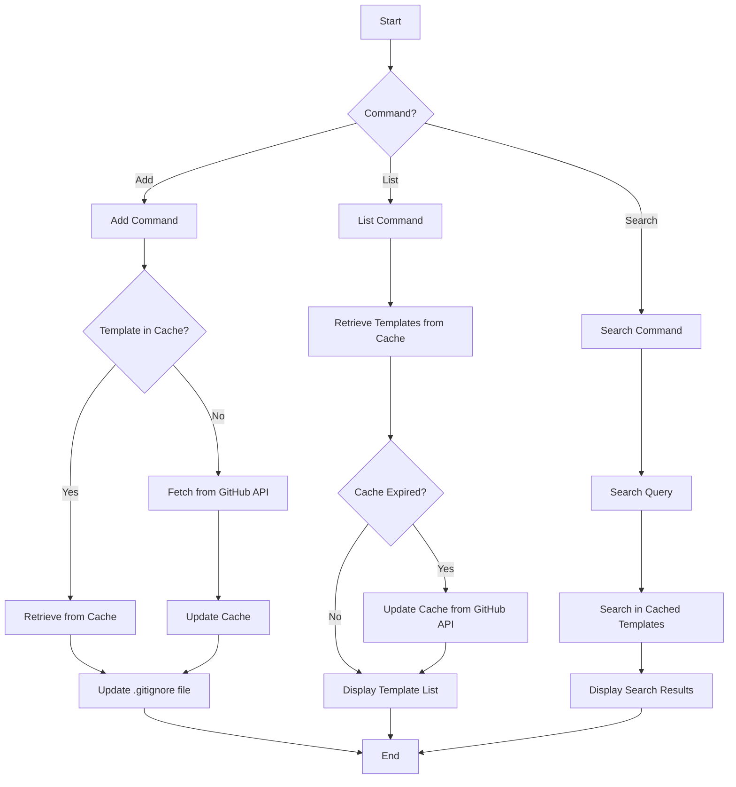

<div align="center">


</div>

# Ignore CLI

`Ignore CLI` is a simple command-line tool for managing `.gitignore` files in your Git repositories. It allows you to easily add, list, and search for `.gitignore` templates, streamlining your workflow and helping you maintain clean repositories.

## Table of Contents

- [Ignore CLI](#ignore-cli)
  - [Table of Contents](#table-of-contents)
  - [Features](#features)
  - [Workflow](#workflow)
  - [Installation](#installation)
    - [From Binary](#from-binary)
    - [From Source](#from-source)
  - [Usage](#usage)
    - [Commands](#commands)
      - [Add](#add)
      - [List](#list)
      - [Search](#search)
  - [Contributing](#contributing)
  - [License](#license)

## Features

- Add `.gitignore` templates to your project
- List available `.gitignore` templates
- Search for specific `.gitignore` templates
- Efficient caching of templates for improved performance
- User-friendly command-line interface built with Cobra

## Workflow



## Installation

### From Binary

To install the `ignore` binary, you can download it from the [releases](https://github.com/tasnimzotder/ignore-cli/releases) page.

### From Source

To build the binary from source, ensure you have Go installed and run the following commands:

```sh
git clone https://github.com/tasnimzotder/ignore-cli.git
cd ignore-cli
make build
```

The binary will be available in the `build/` directory.

## Usage

After installation, you can use the `ignore` command to manage your `.gitignore` files. Here's an overview of the available commands:

```sh
ignore [command] [flags]
```

### Commands

#### Add

Add a `.gitignore` template to your project:

```sh
ignore add <template-name> [--override]
```

- `<template-name>`: The name of the template to add (e.g., "Go", "Node", "Python")
- `--override` or `-o`: Optional flag to override the existing `.gitignore` file

#### List

List all available `.gitignore` templates:

```sh
ignore list
```

#### Search

Search for specific `.gitignore` templates:

```sh
ignore search <query>
```

- `<query>`: The search term to find matching templates

For more detailed information about each command and its options, use the `--help` flag:

```sh
ignore --help
ignore [command] --help
```

## Contributing

Contributions are welcome! Here are some ways you can contribute to this project:

1. Report bugs and suggest features by opening issues
2. Submit pull requests to fix issues or add new features
3. Improve documentation
4. Share your feedback and ideas

Before contributing, please read our [Contributing Guide](CONTRIBUTING.md) for details on our code of conduct and the process for submitting pull requests.

## License

This project is licensed under the MIT License. See the [LICENSE](LICENSE) file for details.
